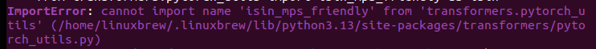

# TTS Experiments
This repository contains several demo files to test different TTS solutions. For each package/library/API explored, I provide an independent interactive test file to play with the functionality. I also provide a description of the package, how to set it up, and some of my own observations from testing. 

**Disclaimer:** Take everything I say with a grain of salt. My machine is different than yours and thus may have different behavior. Similarly, as this is my work machine, there are so many random things installed on it. Between work libraries and all the TTS libraries, there is a chance they are actively hurting each other.

## Test Environment

All files were developed and tested on an Ubuntu 22.04 machine with a 16-core Ryzen 7 CPU, an NVIDIA GeForce RTX 4050 Laptop GPU (trusting Google), and 32 GB of RAM

## Firebot custom endpoints

From my brief look into Firebot, there seem to be 4 ways to implement custom events

#### Run A JavaScript Command

In response to an event, Firebot allows you to directly run a snippet of JavaScript code. Now JavaScript is pretty flexible and does come with many options for TTS. However, most of these are libraries that need to be installed in the environment. If Firebot runs the code in your host environment, that may work. However, if Firebot is running it in a less sketchy isolated environment, access to these libraries may not be available.

#### Run A Full JavaScript Script

Building on that, it is also possible to provide Firebot with a complete custom script to run in response to an event. Allowing for more code does enable larger and more complex functionality, however, these scripts may still be limited by the execution environment they run in.

#### Run A Program

Outside of JavaScript, Firebot can also launch and run an application. This means it would be possible to use a different language such as Python to handle the TTS. This would remove the potential environment issues as the program is guaranteed to be running on your host environment. The downside is it would require launching the application for every event. Depending on the size and complexity of the program, that could be annoying/laggy/resource intensive

#### Send an HTTP Request

application as a server that just sits in the background waiting for events to handle. This cuts out the repeated start-up and tear-down cost of the previous model. Similarly, it also opens up the option to use cloud-based solutions as well.

## Directory Structure
## Data

The data directory holds test files I used to experiment with the different TTS systems. For the most part, the test data is based on the two streams where proto-tts was introduced. I use these streams as a baseline since chat was already working very hard to break the program. As such, it gives me a good mix of odd/edge case messages to push the models. At the time of writing, the available files are as follows:

- noita_cleaned_8_9_26.csv - A chat transcript from the Noita stream where the proto-tts tool was introduced with unneeded columns removed
- noita_raw_8_9_26.csv - The full chat transcript from the Noita stream on 8/9/26
- ostrich_2.wav - A recording of my voice to provide additional training data when testing voice cloning models
- ostrich.wav - A recording of my voice for testing voice cloning models
- sampler.csv - A condensed file of 160ish messages from both streams to provide an easier and quicker way to stress test the models
- valheim_cleaned_8_10_26.csv - A chat transcript from the Valheim stream featuring proto-tts with unneeded columns removed
- valheim_raw_8_10_26.csv - The full chat transcript from the Valheim stream on 8/10/26

**NOTE:** The data directory is encrypted using gpg to protect everyones privacy. Let me know when you are ready to use the data and I will give you the keys to access it

## JavaScript and Node.JS

TODO

## Python

In this section, we discuss all Python-based TTS packages that we test

### pyttsx3

[pyttsx3](https://pypi.org/project/pyttsx3/) is a simple, lightweight, and fully offline TTS engine. For this, pyttsx3 works directly with audio drivers present on your device, namely, pyttsx3 supports:

- SAPI5 for Windows
- NSSpeechSynthesizer for Mac
- espeak for Ubuntu

While pyttsx3 is fairly easy to use (simply start the engine and give it text), this ease also means it's quite limited. For customization, you are only able to set the volume, rate of speech, and voice used by the TTS engine. However, these voices seem to stem from whatever your driver supports and nothing else. As of writing, I don’t see a way to add additional voices.

#### Running the demo

To run the demo file, you will of course need Python as well as the necessary packages. The demo file uses the `pyttsx3` and `csv` packages. To install these packages, run:

```
pip3 install pyttsx3 csv
```
or 
```
python3 -m pip install pyttsx3 csv
```

Once installed, simply navigate to the demo in a terminal and run the file

```
python3 pyttsx3_demo.py
```

This will start an interactive loop for you to play with the engine. For a list of available commands, simply enter `h`

#### Thoughts

As stated earlier, pyttsx3 is incredibly simple and lightweight. This makes it perfect for just starting and leaving it running in the background. However, it's also very limited. During my testing, the voices were very basic and often indistinguishable from each other. This may be because I was testing on Linux, and other Operating Systems have better selections.

I was surprised by how well the TTS was able to handle a myriad of chat messages ranging from normal text to key smash, classic TTS copypastas, special characters, and emojis. For the most part, it read the messages fine. That said, there were a few places it struggled. When reading some foreign text, the engine just said things like “Japanese character” rather than an actual character name. Similarly, for emojis and characters the engine didn't recognize, it either skipped them entirely (as with the pregnant man emoji) or read out the Unicode sequence (as with the hieroglyphics). I will note that I am not sure whether the issue lies with the TTS engine itself or the character encoding of the CSV files used for the test data.

Another thing that I noticed was for more key smashy or memey messages, the engine could start to break down. While this was funny, it would also sometimes cause like a whine in the background

#### Documentation

[pyttsx3 Documentation](https://pyttsx3.readthedocs.io/en/latest/index.html)

### gTTS

[gTTS](https://pypi.org/project/gTTS/) is a Python text-to-speech library that uses Google Translate’s TTS API to convert text into `mp3` files. This is another lightweight library that is very simple to use. However, as it relies on Google Translate, the machine must be online, and options like rate of speech and volume seem fixed.

#### Running the demo

Once again, running the demo requires you have all necessary libraries installed. As such, you will need to make sure you install the `gTTS` package and `csv` package if they aren't installed already. 

```
pip3 install gTTS csv
```
or 
```
python3 -m pip install gTTS csv
```

Similarly, as gTTS only creates an `mp3`, we need something to play it. For that, we use the `playaudio3` package. Again, this can be installed with pip.

```
pip3 install playaudio3
```

Once all packages are successfully installed, simply run the program with Python

```
python3 gtts_demo.py
```

Once loaded, use the `help` command to show available commands

#### Thoughts

gTTS is an interesting package to work with. As stated, it is incredibly simple to work with. At minimum, you just need 4 lines of code to give something voice. Similarly, as it relies on Google Translate's TTS, the voices are pretty good in my opinion. If you have ever watched a Failboat stream or video, I’m pretty sure this is what he uses for Chatty. I am once again surprised at how well the system handled odd messages, emojis, and special characters. Similarly, it is able to read foreign speech, but that is to be expected of Google Translate, I suppose.

That said, there are several quirks to note. The biggest downside in my opinion is the lack of control. Not being able to change the rate of speech of the model can cause some longer/spammier messages to really drag out. That said, there may be a workaround for that with the actual playback library just speeding up the file, but I’m not certain.

The other downside to note is that it does require an internet connection. Now this is not a problem because it needs wifi (that feels like a prereq for streaming), but rather that the communication with Google can sometimes hang. For the most part, messages played one after the other. However, for some messages it would take a couple seconds to start because it took the system longer to process. This seemed to happen for longer messages where the tokenizer didn't have a great space to split the message, as well as when messages included a lot of punctuation.

Now something interesting was the model's stability. For the most part, the model was stable. It's a little arbitrary on when it feels like spelling versus trying to sound a phrase out, but that's fine I’d think. What's more interesting is that for some of the spammier messages, the voice would sometimes crack. It might speed up or slow down for a bit, get louder or quieter, and occasionally the voice would shift/change a little. It could definitely be something fun as well as potentially a breaking point.

Another nuetral/slightly positive thing is that the package lets you define custom abbreviations, pre-processing passes, and a tokenizer. As such, you could further customize how messages are broken up and hopefully spoken, but I’m not sure how much you would be messing with that.

#### Documentation

[gTTS docs](https://gtts.readthedocs.io/en/latest/index.html)

### Coqui  TTS

[Coqui TTS](https://pypi.org/project/coqui-tts/) is a large repository of AI TTS models. Coqui comes with support for up to 70 pretrained models based on different spectrogram models and vocoders. On top of this, a subset of modules also support voice cloning. Along with this, the library comes with all the tools/harnesses needed to build your own datasets and train your own models from them.

Looking at Coqui, I have many open questions. The most glaring issue is licensing. So Coqui was apparently, at least in part, originally  developed by the creator of Mozilla’s TTS engine and went off to make Coqui the company. However, it seems that the original company was shut down at the end of 2023, leaving the project abandoned starting early 2024([source](https://medium.com/@sudeshnm/coqui-tts-deep-dive-into-an-open-source-text-to-speech-framework-129c76a66580)). However, it seems that Coqui the company is back and now offering their services through a monthly license and tokens/credits ([source](https://coquitts.com/pricing)). The important thing to note is you only get commercial rights if you pay them. Interestingly though, the Coqui TTS repository and Python package are both still readily available and free to use. That said, upon installing the package and using it for the first time, it will prompt you as to whether you have a license or agree to the company’s non-commercial license. However, even then, the link they provide is to a page that doesn’t exist but can be found on the Wayback Machine [here](https://web.archive.org/web/20250629003418/https://coqui.ai/cpml/). So ultimately it is unclear to me whether the library is open source and can be used. While I would err on the side of caution, I still played with it anyway.

Another open question is training. So one nice thing about the library is that models are downloaded to your device. In theory, that means any data you use for testing should stay on your device and be private. Does that mean they can't be secretly exfiltrating it in the background? No, not at all, but it is better than some. 

#### Running the demo

Installing Coqui is a bit more involved than some of the other libraries. First, Coqui relies on PyTorch for many of its operations. As such, you will need to install the `torch`, `torchaudi`, and `torchcodec` packages

```
python3 -m pip install torch torchaudio torchcodec
```
**NOTE:** The documentation also includes the option `--torch-backend=auto`. This was not valid on my device, so I left it out

Next, we need to install the library. As we are playing around with all the models just to test them, we need to install all the different language dependencies as well. To achieve both, run:

```
python3 -m pip install coqui-tts[languages]
```

This will install the library and its (many) dependencies. Finally, I once again use the `csv` and `playsound3` packages for the demo. If not installed already, they can be installed with the following command:

```
python3 -m pip install csv playsound3
``` 
Once installed, run the demo as follows:

```
python3 coqui_tts_demo.py
```

Given the number of models offered, the program will first ask you which model you would like to use and then proceed to set up the file for that model. Once loaded, the program will loop as with previous demos. Similarly, all available commands can be shown by entering the help command. To change models, you must restart the program.

#### Local Storage

One nice thing about the package is that models are downloaded to your system so operations are handled locally. That said, if you would like to remove them, default install locations can be found [here](https://coqui-tts.readthedocs.io/en/latest/faq.html). For ease:

- Linux: `~/.local/share/tts`
- Mac: `~/Library/Application Support/tts`
- Windows: `C:\Users\<user>\AppData\Local\tts`

#### Troubleshooting

When setting up the demo, I encountered two errors. First, when using glowTTS (I believe), I got an import error stating that something cannot be imported from the “transformers” file.

<p align="center"></p>

This seems to be an issue with the current branch of the library. If you encounter this issue, simply roll back the transformers library to version 5.0.0 ([source](https://github.com/idiap/coqui-ai-TTS/issues/558)). To do this, run:

```
python3 -m pip install transformers==5.0.0
```

Along with this, when testing with the tortoise model, I saw errors related to the `FFmpeg` library/format. I sadly forgot to grab a screenshot. `FFmpeg` is a pre-requisite for torchcodec and, in my case, was not installed. To fix this, install `FFmpeg`. On Ubuntu, this can be done as follows:

```
sudo apt-get install ffmpeg
```

#### Thoughts

I have a lot of thoughts when it comes to this system. I already stated my concerns about licensing at the start of the section, so I will not repeat myself here. Similarly, I mentioned that it seems like your data never leaves the machine, and that's a plus, however, it is unclear how the pretrained models were originally trained.

Before getting into too much of the minutiae of this library, let's start with the positives. One of the biggest pluses to this library is just the sheer number of models and voice profiles available to the user. In theory, this gives you a lot of options to best fit the TTS to your use case. Further, some models offer voice cloning if you wanted to make custom profiles. Along with this, as models are downloaded to your device, it removes any latency that comes from interacting with a cloud-based service. 

However, for as nice as it is to have multiple models and voices to choose from, the library is complicated. Coqui does provide documentation on how to use a model, and on its own that is fairly simple. The issue is that different models require slightly different parameters to use, and those differences are not really explained. Similarly, much of the library is not talked about. While Coqui provides documentation about what each model is and some of the provided submodules and calls, there is no full documentation (that I could find) for the library. As such, it is unclear what function calls are available to the user and what the different options that can be supplied to them. This makes it a bit harder to customize/tailor to one's needs.

Another concerning issue was the speed of the model. As these are all deep learning-based, they are heavier to run. Due to this, there was a noticeable pause between test messages that ranged from a few seconds to minutes. Therefore, I'm not sure if these models could be used for TTS as intended with chat. That said, these delays are model dependent. I should also note that it wasn’t just the model that was slow. The initial startup of the program and loading of the model also take some time. As such, this could never act as an application open per event and could only ever be viable as a server open in the background.

With that regard, there are too many modules for me to test them all. Instead, I targeted the following 5

#### XTTS_v2

Interestingly, this seems to be Coqui’s flagship model based on that new company page. That said, it is an interesting case. XTTS is a multilingual model, meaning the same model can handle several languages (as compared to other systems that have a unique model per language) and comes with 58 different voices to choose from. Similarly, XTTS allows you to clone custom voices to use. For my tests, I used voice 51 Wulf.

Given it is a multilingual model, it was able to voice foreign characters (Japanese in this case) with ease. However, the model struggled with other special characters. Namely, the model just straight up ignored things like the trademark symbol or heart character present in several messages. Further, some emojis like the pregnant man emoji were misinterpreted as another encoding, resulting in foreign characters being read.

Along with this, the system struggled with longer messages (a recurring theme among models). For long messages, the model would often start off fine but quickly degrade and then stop talking altogether. Along with this, the XTTS model has a built-in character limit of 250 characters, causing some messages to be skipped entirely. The one positive to this is that the model could get unstable, leading to weird results like the good old TTS experiments from a few years ago. While funny, I don't think it outweighs the bad.

The biggest nail in the coffin is that it's slow. For a small message, the model took 10~15 seconds to generate the audio and play it. Then, as messages got longer, this time increased. Due to this, I was only able to run 30 messages of my 160-message test file.

One final thing to note is that this is one of the models that supports voice cloning. In my opinion, I think the model did okay at replicating my voice from about 8 minutes of me rambling. That said, while the voice was okay, the cadence was pretty off. Messages were read very awkwardly with odd pacing that at some point reminded me of the G-Man, but more often than not made me sound deranged. Now both the voice and cadence issues may be improved with additional training data, but I don't know.

#### Tortoise

Tortoise is another model that allows for voice cloning but only comes with a single default voice. Tortoise had a great start to its test by completely crashing my device, though that was likely due to all my work stuff sitting open in the background. One restart later and everything was fine.

As for the actual testing, this model suffered much worse from being slow. Even short messages took forever to process. In about 20~25 minutes while I was writing documentation, the test got through about 15 messages. Again, we saw the pattern where the longer a message, the longer the wait time. However, despite this increased wait, this model was also unable to read long messages, dying halfway through if not sooner. On top of this, the model seemed unable to handle the special characters it encountered. I finally aborted the test after half an hour.

The voice cloning was arguably my favorite of the three models that could do it. In my small-scale testing, the voice clone did seem a bit more variable, with some messages sounding decently like me and others being far off. What won me over as compared to XTTS was that (of the three options), Tortoise seemed to have the most natural-sounding tone and cadence to messages.

#### Bark

The last of the voice cloning models and a special case. Bark is a multilingual model, unless you are using voice clones, then it's single. This flip-floppy nature of the model made it frustrating to use. That said, what actually killed the model was its processing time. In small-scale testing, Bark took drastically longer to process and play audio than Tortoise did. For this reason, I did not even try to test the model against my test files.

Another reason for that decision was the voice clone. Right off the bat, unlike the other models which allowed you to supply multiple files for training, Bark only allowed for a single file. However, once trained, the model was nowhere close to my voice and often changed voices rapidly within a single sentence. During my first test message, the model cycled through three distinct voices. Along with this, the model was so unstable that it would stumble over messages so bad it added words to the message. Due to this, I deemed it not worth testing further. I will note that maybe I messed up or it was something with my device and you may have a better time with it than I

#### Tacotron2_DDC

Tacotron2_DCC is a fairly straightforward model with only a single voice to use. Given this simplicity as compared to other models, Tacotron did run much faster. That said, there were still a couple of seconds between small messages and longer processing times for big messages.

What Tacotron made up for in speed, it lost in ability. Tacotron was unable to handle most special charaters including things like "=", "*", "@", and even " itself. Tacotron also failed to parse other special characters like the trademark symbol, foreign characters, and emojis. Instead, these characters were skipped, resulting in piecemeal messages being read.

One final positive, not really positive, was when it came to long strings of vowels it became very weird. Fun weird, but probably not the best for a functional system.

#### GlowTTS

GlowTTS is another simple model with a single default voice. Of all the models tested, GlowTTS was the fastest. During testing, messages seemed to be played instantly with no noticeable difference for longer messages. Similarly, this model was able to completely handle test messages provided regardless of size. I will note there may be a point where it will also give up. I also did not test the full sample file to keep in step with the other models tested in the library.

That said, the increased speed came at the cost of quality. The default voice is very robotic. That on its own isn't a problem, but it is very sharp and crackly, making it not fun to listen to. Similarly, the model is just awful at pronouncing things. Add to this the common theme of skipping emojis and foreign characters, and the model seems to be more bad than good.

#### Documentation

[github](https://github.com/coqui-ai/tts)

[Documentation](https://coqui-tts.readthedocs.io/en/latest/index.html)

### SmallestAI (For Completeness)

SmallestAI is a subscription model and thus out of the running, I’d assume. At least, I'm not paying to test it

#### Documentation

[github](https://github.com/smallest-inc/smallest-python-sdk)

[Documentation](https://github.com/smallest-inc/smallest-python-sdk/blob/main/reference.md)

[Website](https://smallest.ai/)

### Piper1-gpl

[Piper1-GPL](https://github.com/OHF-Voice/piper1-gpl/tree/main), or Piper, is a local TTS engine that uses the espeak-ng tool (TODO link to section when ready) to generate the phonemes for the engine. Piper comes with several voices that can be downloaded to your device and then used in the system. The library also allows you to train your own model and also contains a brief mention of matching audio to mouth movements along with a link to nightmares ([I hate it](https://github.com/aflr-archive/viseme-to-video)). Outside of that, the repository is very light on description for both the library itself and its available functionality.

#### Running the Demo

Installing Piper is relatively simple as it does not have any prerequisites (I think). So all you need to do is install the package:

```
pip3 install piper-tts
```

**Note:** I generally prefer using `python3 -m pip` for installation, but for me this was causing issues when trying to install the `lxml` library. Instead, I had to use pip3 directly. This is almost certainly an issue with my environment, but rather leave a note to be safe

Outside of that, I again use the `csv` and `playsound3` packages for ease of testing. They can be installed (if not done so already) as follows:

```
python3 -m pip install playsound3 csv
```

Next, you will need to download a voice model to use. First, to list the available voices, open a terminal and run:

```
python3 -m piper.download_voices
```

Once you have found a voice that you like, rerun the command but this time include the desired voice profile:

```
python3 -m piper.download_voices <voice>
```

This will download a `.onnx` and a `.onnx.json` file to your current directory. Move this to the desired location on your system. Next, open the `piper1_demo.py` file and update the `VOICE` global varaible with the path to the `.onnx` file. **Note** that Python bases all file paths from your current directory. As such, it may be better to use the absolute path to the file to avoid confusion. Along with this, there is also a `CUDA` variable that can be changed to enable GPU processing if it is supported. It is off by default. Once configured, save the file and run:

```
python3 piper1_demo.py
```

Like the other files, this will open an interactive loop to play with the library. For available commands, enter `h`

#### Model Configuration

As I mentioned, the repository does not describe the available settings much. Due to this, here is my understanding from my experiments.

- Volume - Self-explanatory, this controls the TTS volume. However, rather than providing a number like 50, it is expecting a scalar. That is to say, if you wanted the model to be twice as loud, you would enter the value `2.0` to multiply the base value by 2. Similarly, to make the model quieter, you set a scalar smaller than 1.
- Rate - Again, a little self-explanatory, though the library actually refers to it as `length_scale`. Once again, it is a scalar where numbers larger than 1 increase the speed of the voice while those below 1 slow it down.
- Audio Variance - This is where things get a little hand wavey. So officially this is listed as `noise_scale` and its only description is "more audio variation". From experiments, this scalar seems to control how unstable the TTS engine is, with values greater than 1 causing more variablility in how the message is read and voice sounds.
- Speaker Variance - Labeled `noise_w_scale` by the library, it's described as "more speaking variation". When messing with it, I never really got a sense of what it did. At best, this setting may change how the voice pronounces words without changing the voice itself like Audio Variance does. However, I cannot be certain as any shifts in pronunciation were not that large. Along with this, setting the scalar to 2.0 seemed to break the voice.
- Normalization - Actually referred to as `normalize_audio`, it is a boolean marking whether to clean the audio.


#### Thoughts

I tested the model with the `en_GB_jenny_diocro-medium` and `en_US_ryan-high` voices. For the most part, the library seemed pretty good. Most messages were read fine and with almost no downtime. Similarly, some of the quirks might be able to be suppressed by messing with the variance settings. It's also nice that the entirety of the model seems to be run locally. That said, I wish there was better documentation about the library. 

So what are the quirks? Well, the model seems to break down in two main cases. First, when doing spammy messages like "rrrrrrrrrrrrrrrrrrrrrrrrr" or "awawawawawawawawawawa" cause it to start just making sounds. While funny, the probelm is it breaks the whole message. So any other information in the message, such as who said it ("user x says"), is completely lost.

The second case is long messages. If a message is too long, the model can similarly become unstable, with the model seeming to slur words together and become less coherent over the course of the message. I'm not sure if this is tied solely to message length but also the complexity of the message. Along with this, some long messages also take a couple seconds to be processed. I believe this is also affected by how many odd symbols are in a message the system doesn't know how to handle.

As for symbol recognition, the model did okay. Piper seemed to be able to read several emojis and symbols, but not all of them. It was unable to parse Japanese, simply stating "Japanese character", and for many emojis/symbols it just read out the Unicode for it. Weirdly, this also sometimes made the voice a bit wobbly.

As one final note, these problems become worse when using the raw audio.

#### Documentation

[What little documentation there is](https://github.com/OHF-Voice/piper1-gpl/blob/main/docs/API_PYTHON.md)


### Kokoro

Oh this is a both complicated and suprisingly clean. Also the My Neighbor Totoro theme is stuck in my head. 

- descrepencies in docs
- manual spacy installs
- voices and their rankings
- advanced features


notes:
- slow message generation or just initial install? 
  - seems like the bulk was the initial but still seems to have slight delay


## Cloud
## Other
JS
    Web Speech API 
        https://developer.mozilla.org/en-US/docs/Web/API/Web_Speech_API/Using_the_Web_Speech_API#speech_synthesis
    talkify
        https://github.com/Hagsten/Talkify
    inworld AI
        https://inworld.ai/resources/javascript-tts-api-tutorial
    responsiveVoice
        https://responsivevoice.org/
    browser_based_tts
        https://dev.to/linmingren/building-a-browser-based-text-to-speech-system-with-piper-tts-ljh
    puter.js
        https://developer.puter.com/tutorials/free-unlimited-text-to-speech-api/

Pyhton
    larynx
        https://github.com/rhasspy/larynx
    edge_tts
        https://medium.com/@tayeblagha/%EF%B8%8F-building-a-text-to-speech-tts-gui-with-python-61e83550ee19
    


Node
    text=to=speech-tts
        https://medium.com/@atlasaidev/add-text-to-speech-to-any-website-with-3-lines-of-javascript-c3df1e524031
    @lobehub/tts
        https://www.npmjs.com/package/@lobehub/tts
    say js
        https://github.com/marak/say.js/

    

Online
    google cloud text to speech
        https://codelabs.developers.google.com/codelabs/cloud-text-speech-node#0


eh
    espeak-ng
        https://github.com/espeak-ng/espeak-ng
    mimic tts/mycroft AI
        https://github.com/MycroftAI/mimic1
    flite
        http://www.festvox.org/flite/
    festival
        http://festvox.org/festival/

general
    https://dev.to/pavkode/lightweight-offline-text-to-speech-solution-for-nodejs-applications-4n68
    https://medium.com/@ebinorpak/how-to-build-your-own-ai-text-to-speech-app-in-minutes-using-node-js-5721ec04287f
    https://www.reddit.com/r/learnmachinelearning/comments/1gbrbtm/free_humanlike_texttospeech_using_python_a_great/
    https://dev.to/mr_nova/text-to-speech-with-python-a-beginners-guide-to-pyttsx3-2pie
    https://picovoice.ai/blog/on-device-text-to-speech-in-python/


https://medium.com/@tayeblagha/%EF%B8%8F-building-a-text-to-speech-tts-gui-with-python-61e83550ee19
https://github.com/rany2/edge-tts
https://github.com/rany2/edge-tts/tree/master/examples
https://github.com/rany2/edge-tts/blob/master/src/edge_tts/util.py
https://edge-tts.com/
https://pypi.org/project/edge-tts-ext/
https://pypi.org/project/edge-tts/

https://pypi.org/project/pykokoro/
https://github.com/buchwandler/pykokoro
https://pykokoro.readthedocs.io/en/latest/index.html
https://huggingface.co/hexgrad/Kokoro-82M#model-facts
https://github.com/hexgrad/kokoro
https://pypi.org/project/kokoro/
https://github.com/hexgrad/kokoro
